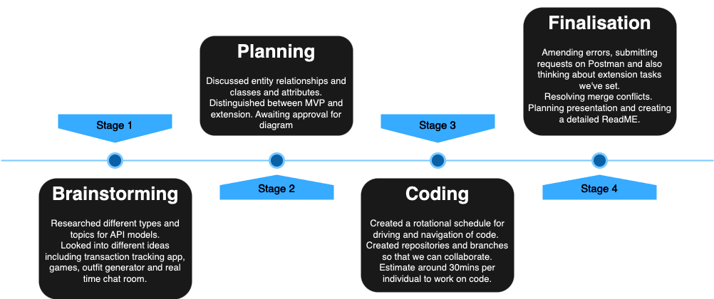
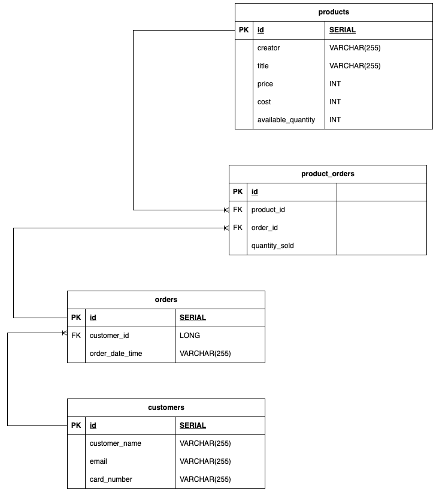
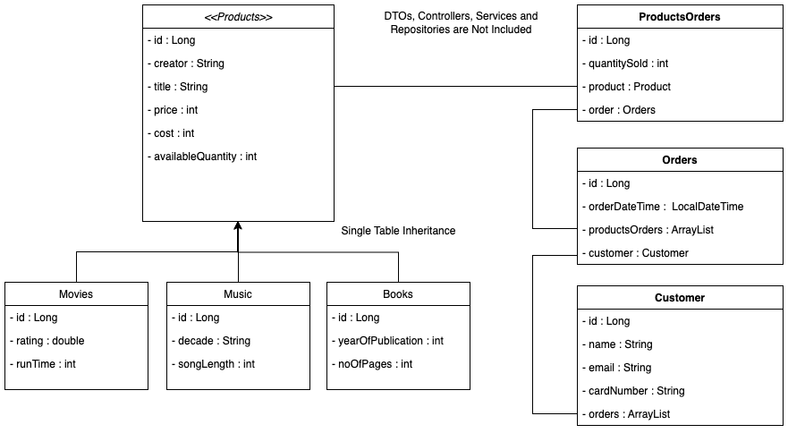

# **Backend Project (BNTA Week 7)**
## **List of collaborators**
The following project is a collaboration effort between the following members on BNTA C11:
> - Blezzy Dela Cruz (Github:[blezzydcruz](https://github.com/blezzydcruz))
> - Jannah Anwar (Github: [jannahthecodemaster](https://github.com/jannahthecodemaster))
> - Mohamed I. Hussain (Github: [essamcreates](https://github.com/essamcreates))
> - Tarek Ahmed (Github: [TarekQMUL](https://github.com/TarekQMUL))
## **Project Theme**
Our stock management system for media shops draws inspiration from the dynamic and ever-evolving nature of the media industry. Just as media content constantly evolves and adapts to new trends, our system is designed to efficiently manage and track a diverse range of media products such as books, movies and music. This system is designed to provide store managers with the tools to effortlessly monitor stock levels, anticipate demand and ensure a seamless customer experience. 
This API was coded in Java. We used the SpringBoot that implements the Spring Framework as well as Postman and PostgreSQL to view the API request endpoints. 
## **Project Timeline**
> - Friday 11/08/23 -- Brainstorm different themes  
> - Monday 14/08/23 -- Planning ERD and UMLs, thinking about MVP and Extensions
> - Tuesday 15/08/23 -- Building project skeleton including models and repositories, single table
> - Wednesday 16/08/23 -- Adding functionalities including product subclasses, populated database and routes
> - Thursday 17/08/23 -- Finalising project code, building up routes and mapping
> - Friday 18/08/23 -- Presentation day

## The API
> - We have a one-to-many relationship between Customers and Orders
> - We have a one-to-many relationship between Orders and Product_orders
> - We have a one-to-many relationship between Products and Product_orders
## **Entity Relationship Diagram (ERD)**

## **Class Diagram**

## **Dependencies**
- Spring Web
- SpringBoot DevTools
- Spring Data JPA
- PostgreSQL
## **Our Commands**
1. **GET (SHOW)**
2. **POST (CREATE)**
3. **PUT (CREATE)**
4. **DELETE**
## **Postman Commands**
> - Get Customers: localhost:8080/customers
> - Get Products:  localhost:8080/products
> - Create an Order for Customer 1: localhost:8080/customers/addOrder/1
> - Link Products with Product Orders: localhost:8080/orders/linkProdOrders/1/100
> - Link the Order with Product Orders: localhost:8080/orders/linkOrderProdOrder/1/1
> - Show Product Orders which contains the orders with the customers: localhost:8080/productsOrders
